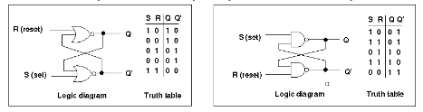
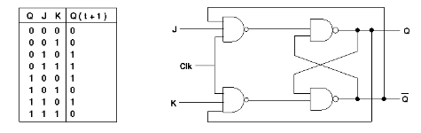
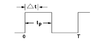
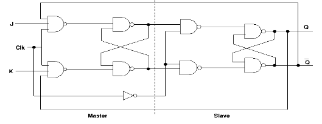
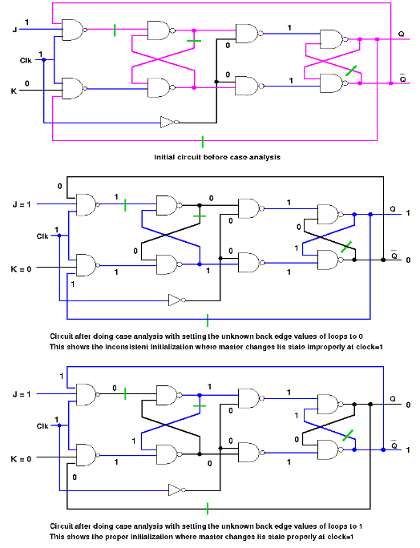
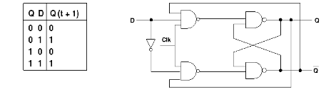

## Theory

### Synthesis of Flip Flops

Till now the experiments are based only on the combinational circuits where output at any instance depends only on the current input. Most of components of digital logic consists combinational circuits but they likely to have memory elements too. Those type of circuits are known to be sequential circuits. In a sequential circuit the present output is not only determined by the present input but also depends on the past output. flip-flops are the simplest kind of sequential circuits. A flip-flop can maintain a binary state identity which means it can act as 1-bit memory cell. There are different kind of flip-flops depending on the number of inputs or the way the inputs affect the states.

**Basic flip-flop** : A basic flip-flop circuit can be constructed using two cross-coupled NAND/NOR gates shown below . Each flip-flop has two outputs, Q and Q', and two inputs, set and reset. When the set input goes to 1 the Q output goes to 1 and the Q' goes to 1 when reset goes to 1. But when both set, reset are 1, both Q, Q' outputs go to 0 for basic flip-flop circuit with NOR gates. In basic flip-flop circuit with NAND gates, when both input go to 0, both outputs go to 0 violating the fact that the outputs of the flip-flop have to be complement of each other.

There are various different kind of **flip-flops**. Some of the common flip-flops are: R-S flip-flop, D flip-flop, J-K flip-flop, T flip-flop etc.

1. **Clocked RS flip-flop** : The basic flip-flop is modified by adding some gates to the inputs so that the flip-flop changes state only when the clock pulse is 1. The truth table for this type of flip-flop is shown below. If R is high then reset state occurs and when S=1 then set state. However, if both the inputs are 1 then it violates normal operation of flip-flop.

2. **JK flip-flop**: JK flip-flop is a refinement of RS flip-flop where the indeterminate state of RS type is defined. Input J and K are respectively the set and reset inputs of the flip-flop. When both the inputs are high then the output of the flip-flop switches to its complemented state.A clocked JK flip-flop is shown below.

In level triggred JK flip-flops, at J=1 and K=1, a timimg problem, known as race around condition arises which can be explained by the following diagram. Let the width of a clock pulse is tp and the current output Q is 1. when the clock is applied, after the propagation delay, say dt, the output will toggle and now the output Q will be 0. If dt is less than tp, then after dt the output Q will again toggle and become 1. Thus the output will oscillate between 0 and 1 within the tp interval, so at the end of the clock pulse tp, the output will be ambiguous.

Master slave JK flip-flop overcome this race around condition. The following figure depicts the circuit diagram.

However, the master slave circuit, though handles race around condition, it may work improperly initially, if it has inconsistent initialization. Ideally, initially the master and the slave should have the same value, but if it does not, then it leads to inconsistent initialization, for which the circuit behaves improperly. Bellow is a case showing the improper output for an inconsistent initialization. Here, at clock=1, the master is supposed to change its state acordingly, but.......

The problem occured due to the inconsistent initialization in the master slave JK flip-flop can be avoided by asynchronously presetting or clearing the flip-flop. The circuit diagram is shown bellow.

3. **D flip-flop**: The D flip-flop is used to transfer data to the flip-flop. It is basically the JK flip-flop where the the K input is inverted. The circuit diagram of the D flip-flop is shown below:

4. **Tflip-flop**: The T or "toggle" flip-flop changes its output on each clock edge. The truth table as follows:

